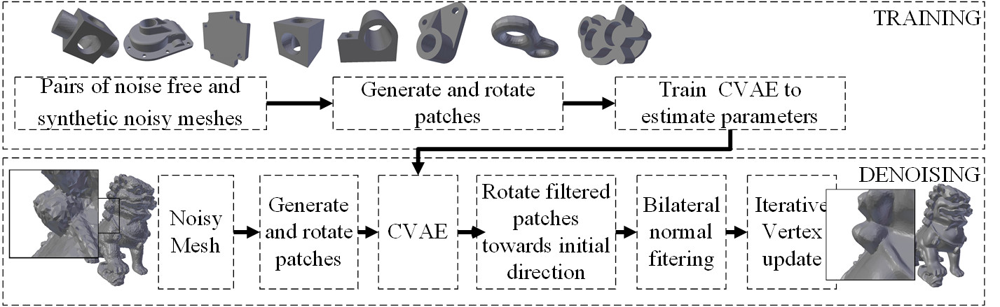
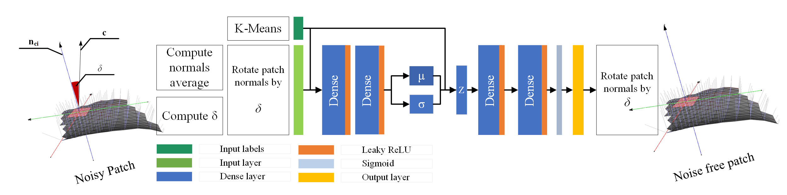

# Mesh Saliency Extraction

This is an implementation for the paper entitled "Fast mesh denoising with data driven normal filtering using deep variational autoencoders" published in IEEE Transactions on Industrial Informatics 10.1109/TII.2020.3000491

## Description 
Recent advances in 3D scanning technology have enabled the deployment of 3D models in various industrial applications like digital twins, remote inspection and reverse engineering. Despite their evolving performance, 3D scanners, still introduce noise and artifacts in the acquired dense models. In this work, we propose a fast and robust denoising method for dense 3D scanned industrial models. The proposed approach employs conditional variational autoencoders to effectively filter face normals. Training and inference are performed in a sliding patch setup reducing the size of the required training data and execution times. We conducted extensive evaluation studies using 3D scanned and CAD models. The results verify plausible denoising outcomes, demonstrating similar or higher reconstruction accuracy, compared to other state-of-the-art approaches. Specifically, for 3D models with more than 1e4 faces, the presented pipeline is twice as fast as methods with equivalent reconstruction error.

## Requirements

1. Tensorflow
2. Numpy
3. Pickle
4. Matplotlib
5. SKLearn
6. Scipy
7. Gzip
8. Random

## Overview

Pipeline of the proposed approach and training scheme of the CVAE

## Running the code

### Train with groundtruth data

     python fastMeshDenoising_CVAE_Train.py
     
### Inference 

    python fastMeshDenoising_CVAE_Test_On_The_Fly.py
     

The generated model can be found in 

    ./results/Comparison/Denoised/CVAE/

## Notes

### Repository with full code and data  

	https://gitlab.com/vvr/snousias/fast-mesh-denoising

### Structure
    ./data/
    ./images/
    ./meshes/
    ./results/
    ./sessions/
    commonReadModelV3.py
    CVAE.py
    CVAEplot.py
    CVAEutils.py
    fastMeshDenoising*.py

### Select a model from a list of models 
Models in .obj format are found in./meshes/

    trainModels = [
               'block',
               'casting',
               'coverrear_Lp',
               'ccylinder',
               'eight',
               'joint',
               'part-Lp',
               'cad',
               'fandisk',
               'chinese-lion',
               'sculpt',
               'rockerarm',
               'smooth-feature',
               'trim-star',
               'gear',
               'boy01-scanned',
               'boy02-scanned',
               'pyramid-scanned',
               'girl-scanned',
               'cone-scanned',
               'sharp-sphere',
               'leg',
               'screwdriver',
               'carter100K',
               'pulley',
               'pulley-defects'
               ]

### Training set 
Training set comprises of the first eight models in fastMeshDenoising_Config_Train.py

    trainSet=range(0, 8)
    
###Testing model
Testing model is defined by flag "selectedModel" in fastMeshDenoising_CVAE_Test_On_The_Fly.py

    selectedModel = 10
    

# Citation info

### Citation 

    S. Nousias, G. Arvanitis, A. Lalos, and K. Moustakas, “Fast mesh denoising with data driven normal filtering using deep variational autoencoders,” IEEE Trans. Ind. Informatics, pp. 1–1, 2020.

### Bibtex 

    @article{Nousias2020,
        author = {Nousias, Stavros and Arvanitis, Gerasimos and Lalos, Aris and Moustakas, Konstantinos},
        doi = {10.1109/TII.2020.3000491},
        issn = {1551-3203},
        journal = {IEEE Transactions on Industrial Informatics},
        pages = {1--1},
        title = {{Fast mesh denoising with data driven normal filtering using deep variational autoencoders}},
        url = {https://ieeexplore.ieee.org/document/9110709/},
        year = {2020}
        }
